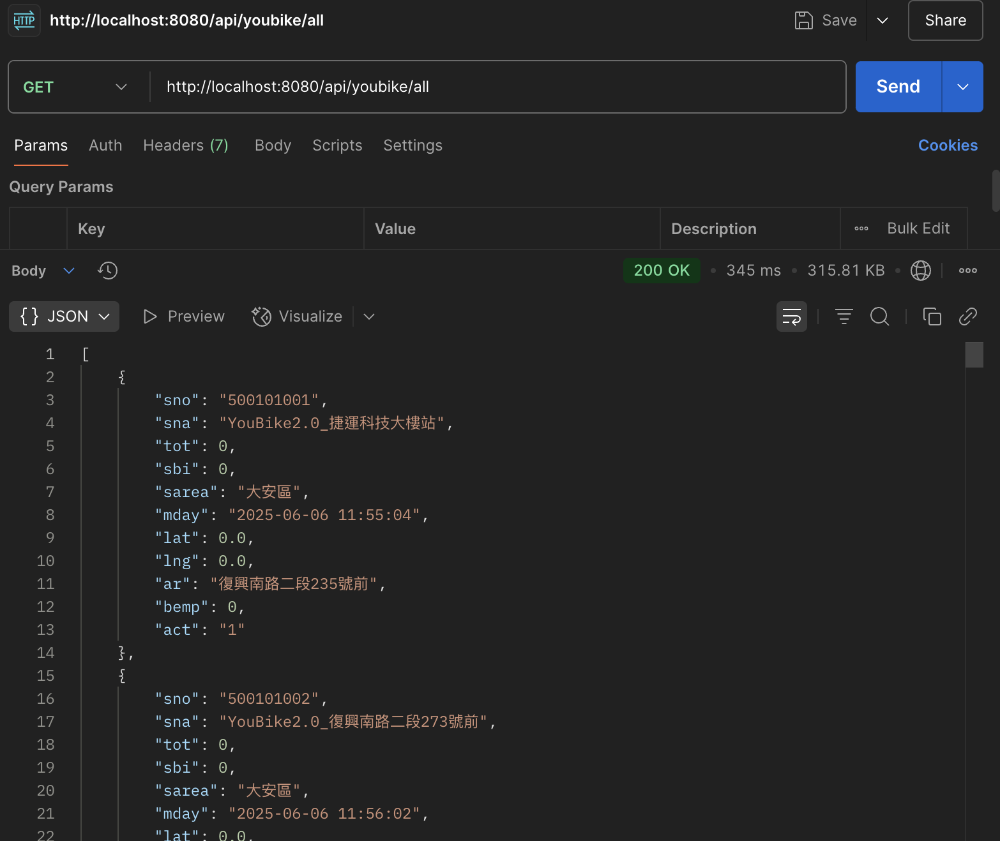
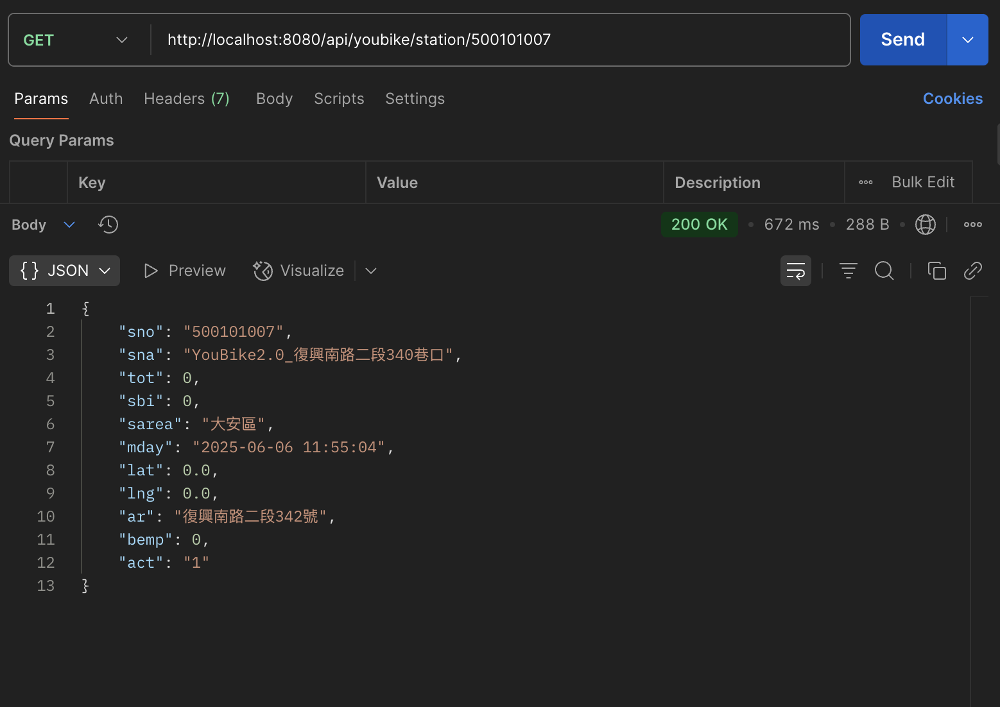

# quarkus-training

根據[Quarkus 四週學習計畫](https://webglsoft.atlassian.net/wiki/spaces/TC/pages/368607247/Quarkus)的練習專案

## 第一週：基礎入門 & RESTful API 開發

### 開發兩隻 API
* GET /api/youbike/all：YouBike 即時 JSON 資料。
> 
* GET /api/youbike/station/{id}：查詢指定站點資訊。
> 

## 第二週：MongoDB 與 Redis 實務

### 開發兩隻 API
* POST /api/youbike/import：一次匯入多筆站點資料進 MongoDB。
* GET /api/youbike/all：從 MongoDB 撈取資料。
> 
* GET /api/youbike/station/{id}：自動切換快取與DB來源。
> 